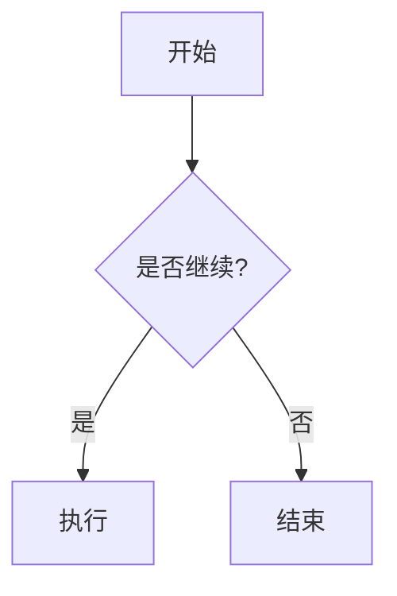

# Markdown Syntax Test

## 1. 标题

# H1

## H2

### H3

#### H4

##### H5

###### H6

## 2. 段落与换行

这是第一段。

这是第二段。  
这是同一段中的换行。

## 3. 强调

_斜体_

**粗体**

**_粗斜体_**

~~删除线~~

## 4. 引用

> 一级引用
>
> > 二级引用
> >
> > > 三级引用

## 5. 列表

### 无序列表

- 项目 A
- 项目 B
  - 子项目 B1
  - 子项目 B2
    - 子项目 B2-1

- 星号列表

- 加号列表

### 有序列表

1. 第一项
2. 第二项
   1. 子项 2.1
   2. 子项 2.2
3. 第三项

### 任务列表

- [x] 已完成
- [ ] 未完成

## 6. 行内代码

这是 `inline code` 示例。

## 7. 代码块

### JavaScript

```js
function hello(name) {
  console.log(`Hello, ${name}!`)
}

hello('Markdown')
```

### Python

```python
def fib(n):
    a, b = 0, 1
    while a < n:
        print(a)
        a, b = b, a + b

fib(100)
```

### JSON

```json
{
  "name": "Markdown",
  "version": 1,
  "features": ["table", "code", "task-list"]
}
```

## 8. 分隔线

---

---

---

## 9. 链接

[OpenAI](https://openai.com)

## 10. 图片


## 11. 表格

| 名称     | 类型     | 描述     |
| -------- | -------- | -------- |
| Markdown | 标记语言 | 轻量级   |
| HTML     | 标记语言 | 网页结构 |
| CSS      | 样式语言 | 页面样式 |

### 对齐

| 左对齐 | 居中 | 右对齐 |
| :----- | :--: | -----: |
| A      |  B   |      C |
| 1      |  2   |      3 |

## 12. 转义字符

\*不是斜体\*

\# 不是标题

\`不是代码\`

## 13. HTML 混写

<div style={{ color: 'red' }}>这是 HTML 内容</div>

:::details
::summary[点击展开]
隐藏内容测试。
:::

## 14. Footnote（部分解析器支持）

这是一个脚注示例。[^1]

[^1]: 这里是脚注内容。

## 15. Definition List（部分解析器支持）

Markdown
: 一种轻量级标记语言

HTML
: 超文本标记语言

## 16. Emoji

😀 🚀 🎉 ❤️

`:smile:` → 😄

## 17. 数学公式（部分解析器支持）

行内公式：

$E = mc^2$

块级公式：

$$
\int_0^1 x^2 dx
$$

## 18. Mermaid（部分解析器支持）



## 19. YAML Front Matter（部分解析器支持）

```yaml
---
title: Markdown Test
author: ChatGPT
date: 2026-05-10
tags:
  - markdown
  - test
---
```

## 20. 混合复杂示例

> ### 引用中的标题
>
> - 列表项
> - `代码`
>
> ```bash
> echo "hello"
> ```
>
> [链接](https://example.com)

## 21. 特殊字符

| 字符 | 示例   |
| ---- | ------ |
| `*`  | 星号   |
| `_`  | 下划线 |
| `#`  | 井号   |
| `\|` | 管道符 |
| `>`  | 引用   |
| `~`  | 波浪线 |

## 22. 超长文本换行测试

Lorem ipsum dolor sit amet, consectetur adipiscing elit, sed do eiusmod tempor incididunt ut labore et dolore magna aliqua.

## 23. 中文 / English / 日本語

中文测试。

English test.

日本語テスト。

## 24. 嵌套组合

1. 第一层
   - 第二层
     > 第三层引用
     >
     > ```txt
     > nested code
     > ```

## 25. 结束

Markdown 全语法测试完成。
